  

  
  
  

 

### `00` &nbsp;about

I build products end to end: requirements, UI/UX, frontend, backend, database and the AWS box it runs on. Most of my recent work has shipped as a one-person engineering team across web, Android and iOS.

B.E. in Electronics & Telecommunication from Zeal College of Engineering, Pune University (2020 – 2024).

  

 

### `01` &nbsp;work

<table>
  <tr>
    <td width="50%" valign="top">
      <code>01</code>
      <h4>College ERP System</h4>
      
ERP for a college covering admissions, fees, attendance, inquiries, calling and results. Includes fee payment prediction, automated reminders and a result insight generator.

      <b>Next.js · Java · MySQL · AWS EC2</b>
    </td>
    <td width="50%" valign="top">
      <code>02</code>
      <h4>Number Aacharya</h4>
      
Numerology and analytics platform: a Flutter app on Google Play with 2,000+ downloads and a web portal serving 1,400+ active customers. Built solo.

      <b>Flutter · Java · Web</b>
    </td>
  </tr>
  <tr>
    <td width="50%" valign="top">
      <code>03</code>
      <h4>Sowilosoul.com</h4>
      
Performance-optimized Next.js web application on Vercel, serving 1,000+ users.

      <b>Next.js · Vercel</b>
    </td>
    <td width="50%" valign="top">
      <code>04</code>
      <h4>Shiksha Foundation App</h4>
      
Hybrid mobile app for Android and iOS with 500+ downloads.

      <b>Angular · Express.js · MySQL · Capacitor</b>
    </td>
  </tr>
</table>

 

### `02` &nbsp;stack

<table>
  <tr>
    <td><b>LANGUAGES</b></td>
    <td>
      
      
      
      
    </td>
  </tr>
  <tr>
    <td><b>FRONTEND</b></td>
    <td>
      
      
      
      
      
      
    </td>
  </tr>
  <tr>
    <td><b>MOBILE</b></td>
    <td>
      
      
      
      
    </td>
  </tr>
  <tr>
    <td><b>BACKEND</b></td>
    <td>
      
      
      
      
    </td>
  </tr>
  <tr>
    <td><b>DATABASES</b></td>
    <td>
      
      
      
    </td>
  </tr>
  <tr>
    <td><b>CLOUD&nbsp;&amp;&nbsp;DEVOPS</b></td>
    <td>
      
      
      
      
      
    </td>
  </tr>
  <tr>
    <td><b>TOOLS</b></td>
    <td>
      
      
      
      
      
      
      
    </td>
  </tr>
</table>

 

### `03` &nbsp;github

  
  

 

### `04` &nbsp;certifications

- Java Microservices with Spring Boot and Spring Cloud — Google, 2023
- Foundations of Project Management — Google, 2022
- CSS Certification — HackerRank, 2022

 

  

